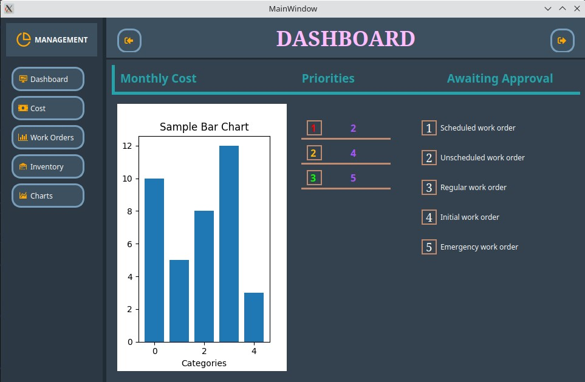
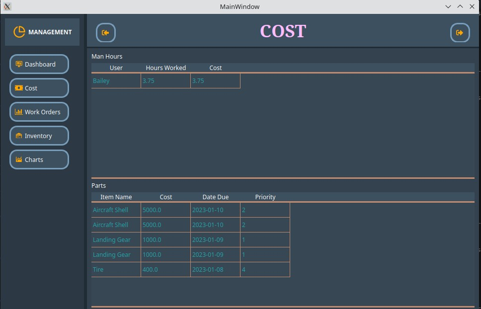
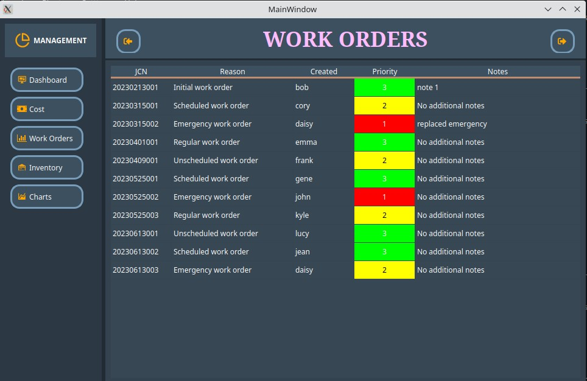
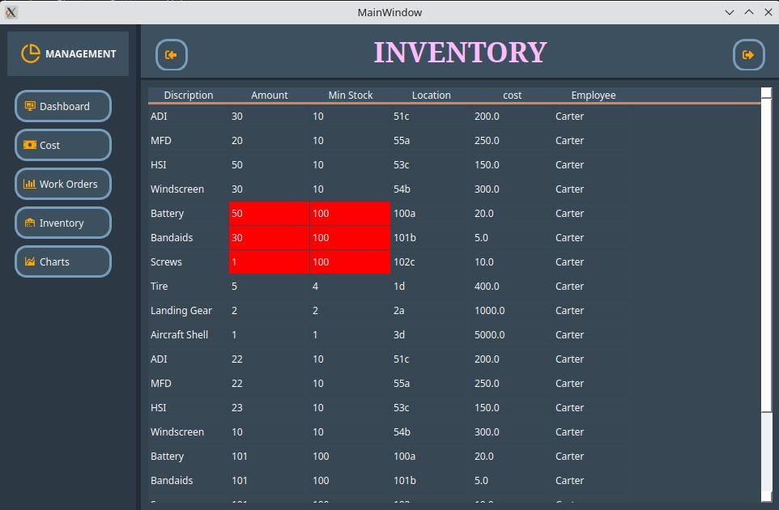

# Project-assignment
SDEV-Project
# Project Assignment - Management UI

This project contains a management user interface (UI) for an application. The main program, `login.py`, is located in the following folder:
`Project-assignment/UI-Design/combined/`

## TODO

The following tasks are yet to be completed for the project:

1. Complete chart integration.\
  1a. Complete logistic charts\
  1b. Check all charts for appropriate data\
  1c. Fix the sign-off bug that doesn't resize the chart after it is hidden.
3. Allow users to change the work order state to ready for close
4. Update all UI's if they do not look right.
5. Look into adding schedule UI and tasks
6. Maint. should be able to switch work orders to be in any state.  May need to have it switch screens.

## Application Preview

This screenshot provides a preview of the application's user interface.

## Additional Notes

123 ... bla bla bla

